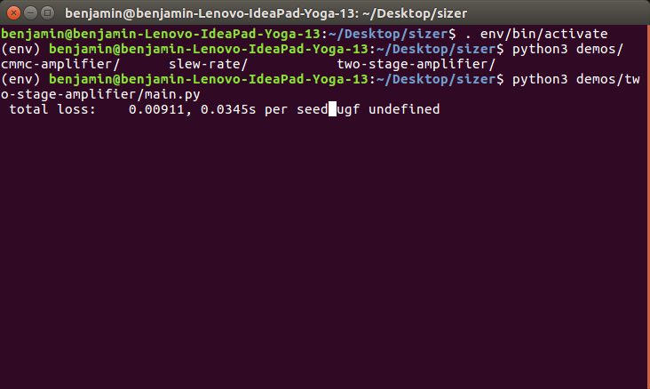
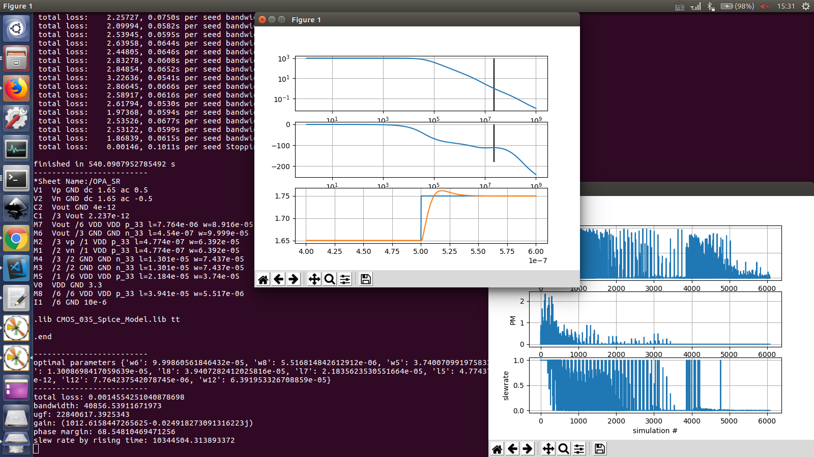
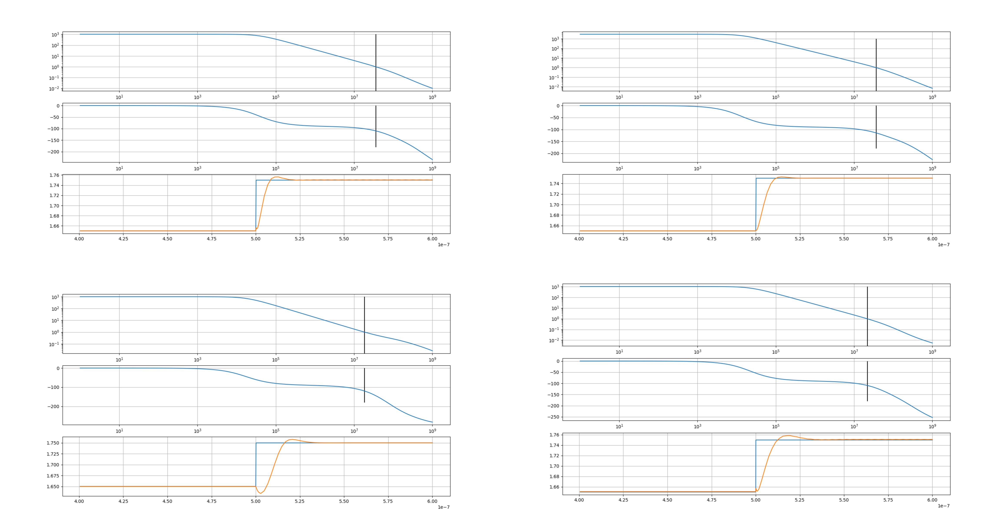
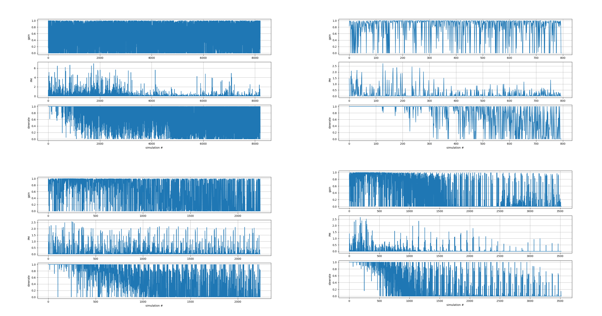
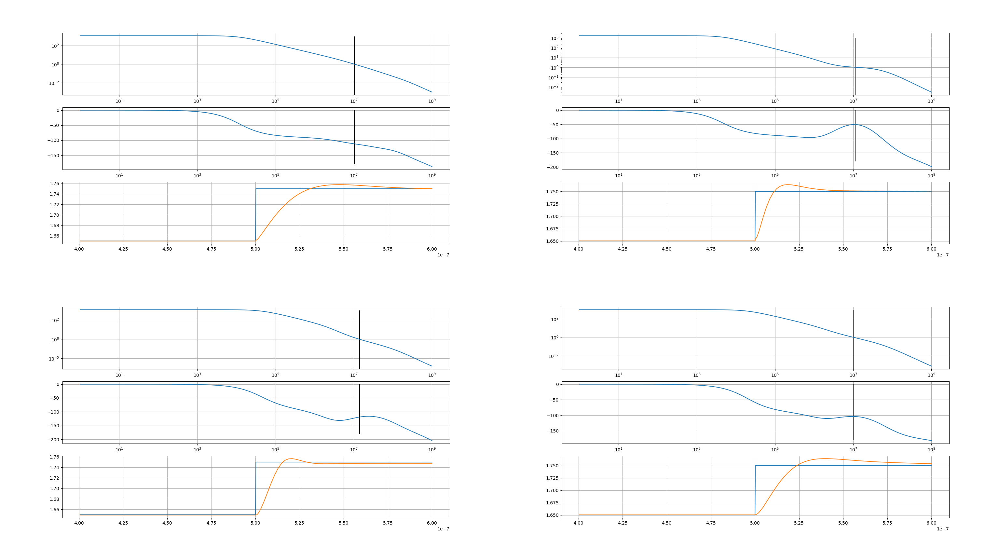
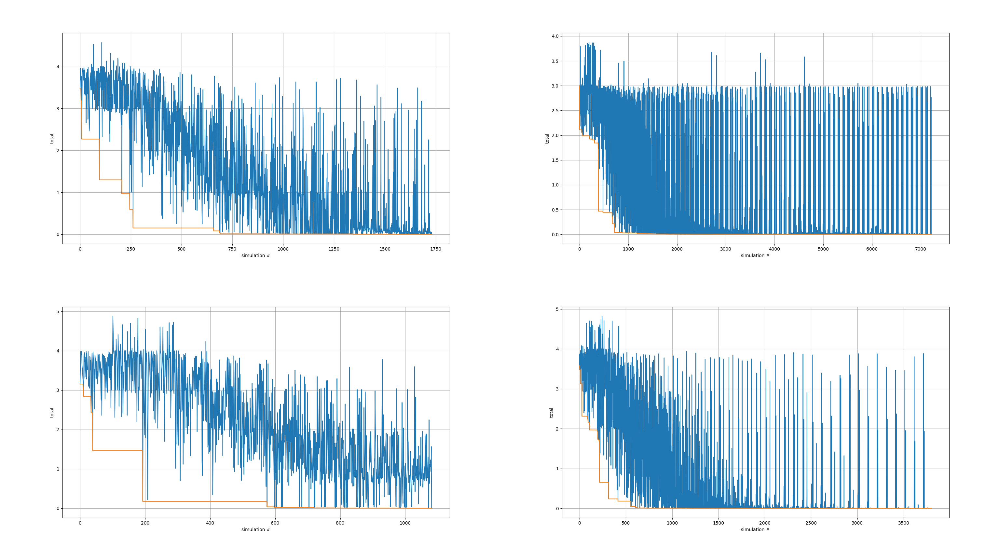
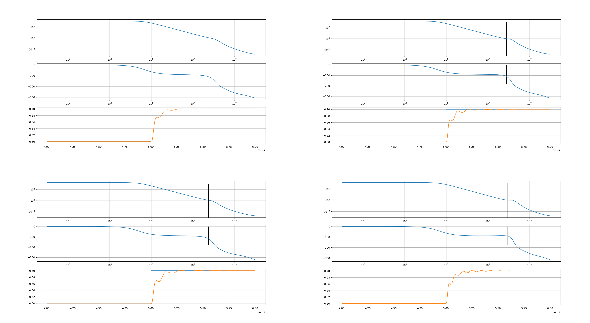
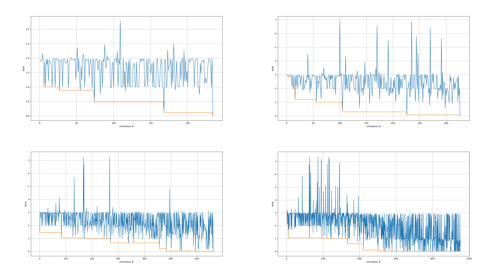

========================
高性能运算放大器的自动化设计
========================

.. contents:: 目录

.. section-numbering::

摘要
=====

本文回顾了集成电路发展的历史，分析了模拟集成电路设计中普遍存在的自动化程度较低的问题，研究了运算放大器的设计过程，总结出了运算放大器设计的一种数学的、形式化的描述方法，并基于Python语言、ngspice电路仿真模拟器，实现了一个能够自动搜索电路元件参数的软件工具sizer。这个程序能够读取SPICE网表，根据用户定义的性能指标、元件参数范围等要求，利用优化算法，自动搜索得出满足要求的一组元件参数。本文将这个程序应用在几个具体的案例上，测试了程序的效果和性能。实验结果显示本文的程序能够成功解决二阶、三阶运算放大器的元件参数设计问题，并在合理的时间范围内给出一组不逊于手动设计的、满足所有设计指标要求的解，验证了运算放大器自动化设计的可行性和实用性。

关键字：EDA、自动设计、运算放大器、数学优化

Abstract
========

This paper reviews the history of integrated circuits, and points out the long-lasting problem that analog circuit design lacks sufficient automation. This paper then looks into the design problem of an analog operational amplifier, concludes a mathematical formal description of the design problem, and later implements a software toolkit named sizer that can automatically search for the optimal parameter set, using the Python programming language and ngspice simulator. Given a circuit topology written in SPICE netlist, user-defined design objectives and parameter bounds, the toolkit is capable of returning a set of circuit parameters that meets all design requirements. This paper applies the toolkit onto several practical use cases to test its performance. Experiments show that the toolkit can deal with real-life two-stage and three-stage amplifiers' design problems and return within a reasonable range of time duration, proving that amplifier's automated design is practically feasible.

Keywords: EDA, automated design, operational amplifier, mathematical optimization

绪论
=====

距离集成电路的发明已经过去半个多世纪了。在这半个世纪中，集成电路以及它支撑的软件、互联网产业已经给世界带来了翻天覆地的变化。回顾集成电路从最初发明、到发展成为世界级尖端制造业的这半个多世纪的历程，我们不难发现，集成电路的快速发展很大程度上得益于集成电路自动化设计工具的进步。

以Intel为例，1971年英特尔的4004微处理器大概包含了1000颗晶体管，尚且能采用全手动设计、手动布局布线，而到了2000年，英特尔的Pentium微处理器已经包含了上亿个晶体管，想要像4004那样采用全手动设计几乎是不可能的。

好在从4004到Pentium并不是一蹴而就的过程：从1971到2000年，这其中的三十年，计算机硬件经历了从大型机到微型机、再到个人计算机的过程。硬件的发展推动了软件行业的诞生，使集成电路工程师逐渐开始依赖软件来辅助设计，设计出功能更强大、逻辑更复杂、晶体管数量更大的复杂电路系统。这样，硬件发展推动软件发展，性能更加强劲的硬件使得功能更强大、计算量需求更大、存储空间需求更大的软件能在更短的时间里运行完毕，反过来工程师借助这些功能更强大的软件、包括电路辅助设计软件，能更加容易地设计出更复杂的电路系统。硬件推动软件，软件反哺硬件，逐渐形成一种非常积极的正反馈发展模式。

除此之外，电路设计领域也积极吸收软件开发中的经验和思路，借鉴了软件开发中模块化、多层次抽象、模块复用、泛型等思想，产生了诸如Verilog HDL的硬件描述语言、硬件描述语言编译器，使得数字逻辑设计的门槛进一步降低。

可惜的是，上面的正反馈发展模式几乎只适用于数字电路，自动化设计在模拟电路设计中无法发挥很大的作用，原因包括但不限于

-   模拟电路对工艺极其敏感

    比如某个设计在某个工艺制程下工作良好，但是一旦工艺进步，模拟电路的寄生分布可能会有较大变化，整个电路都可能无法正常工作，此时整个设计都需要完全推倒重来。

    作为对比，数字电路一般情况下对寄生并不是很敏感，因此对工艺的区别也没有那么敏感。

-   模拟电路难以模块化、难以重用

    除了与工艺紧耦合导致无法模块化之外，模拟电路模块之间的匹配一直以来都是一个问题，因为模拟电路通常工作在某个静态工作点附近，输入输出带有直流电平，如果不同模块接受、输出的直流电平不同，会影响后级电路的静态工作点，使电路工作不正常。

    作为对比，数字电路在迁移工艺的时候，有时甚至根本无需更改硬件描述语言代码，就可以在新工艺下工作良好。

-   模拟电路极其依赖经验

    数字电路在设计过程中经常出现的问题是逻辑错误，此时检查逻辑就可以解决问题。但是模拟电路出错可能有各种各样稀奇古怪的、难以想象的原因。此外，在设计模拟电路的时候，充满了各种折中；在分析复杂模拟电路的时候，为了避免传输函数过于复杂、不可读，还要采取各种近似。这一切都严重依赖模拟工程师的经验。

模拟电路深受自动化程度不足之害。设计厂商为了保证产品开发周期、提高自身竞争的时间优势，常常采用的手段是回避模拟电路——尽可能用数字电路代替模拟电路，能用数字电路就用数字电路而不用模拟电路——来节省开发时间。这种趋势愈演愈烈，直到现在，现代集成电路芯片上模拟电路占用的面积通常大约只有10% [rocha2014]_ ，其余广大的90%左右的面积都是数字电路。

这样回避模拟电路虽然是厂商的无奈之举，但是模拟电路在某些应用上始终是无法被数字电路替代的，因为世界和大自然是模拟的、连续的，某些组件只能用模拟电路实现，例如ADC、DAC、传感单元。此外，针对某些特定应用，模拟电路实现比数字电路实现在成本、效率、功耗方面都有相当大的优势，比如滤波器，用数字电路可能需要使用上百元的、功耗数十瓦的高速数字信号处理器，用模拟电路可能是几分钱、几毫瓦的RLC网络。

因此如果能实现模拟电路设计自动化，就可以在很大程度上降低模拟电路设计的门槛、释放模拟电路的潜力、降低业界对数字电路的过度依赖。运算放大器同时又是模拟电路中重要的核心模块，常常与其他模块一起构成复杂的模拟电路系统，而且运算放大器的性能通常决定了整个系统的性能极限。以运算放大器为突破口，研究其自动化设计的可行性，应该能为其他模块的自动化设计提供很多思路。

本文就出于这样的愿景，设计了可以自动设计运算放大器电路参数的一套系统，希望能为模拟电路自动化贡献一点微薄之力。

研究动机
-------

本课题在作者大二第一次学习模拟电路的时候就逐渐产生了，到作者大三学习了两个学期CMOS模拟集成电路课程的时候，对这个课题的兴趣愈发强烈。本课题的起源和动机非常简单：在课程中，经常会遇到针对一系列性能、功耗指标来设计运算放大器的需求，例如，要求设计一个满足

-   增益大于1000
-   相位裕度大于60度
-   带宽大于1 MHz
-   ...

的运算放大器。通常手动设计的流程是

1.  查文献，初步选择电路拓扑结构
2.  查文献、或手动推导传输函数
3.  将性能、功耗指标写成与电路小信号参数相关的不等式组、方程组
4.  解不等式组、方程组，得到晶体管尺寸、其他元件参数
5.  仿真验证，回炉再造或是进入版图阶段

看上去不复杂的流程，在实际操作的时候会出现诸多问题，例如

2.  查文献、或手动推导传输函数

    对于结构简单的运算放大器，如无补偿二阶运算放大器、或是简单Miller补偿运算放大器，因为电路结构较为简单，尚且可以通过手动推导来得到传输函数；对于结构较复杂的，基本上无法通过手动推导，只能查阅文献，借鉴大师们 [#]_ 的计算结果；或者自己使用符号运算系统（如Sympy [meurer2017]_ ）自行推导。

    而这也引出了下一个问题：符号运算系统只能按部就班地算出传输函数，如果电路很复杂，计算出的传输函数的规模将会极其巨大，可能能写满两页A4纸。这会直接阻碍下一步的工作。

    .. [#] 我绝对没有讽刺的意思在里面。真的。

3.  将性能、功耗指标写成与电路小信号参数相关的不等式组、方程组

    电路的动态性能参数通常是从频率响应曲线中提取的，所以放大器的动态性能指标，如直流增益、带宽、相位裕度，也是传输函数的函数。但是正如上面所说的，这也通常是一个艰巨的任务，大师们可能不会事无巨细地推导出所有符号形式的性能指标，所以常常需要自己使用符号运算系统计算出的结果。问题就在于，如何从一个能写一页A4纸的传输函数里提取出增益、带宽、相位裕度等参数呢？

    这时候，大师们所做的一般是运用他们数十年积累的经验，告诉你一个近似的结果，这个近似结果足够简单、又能体现贡献这个参数的最主要的方面，并且最重要的是与完全精确解差距不是很大。但如果大师们并没有计算这个参数，那么就需要你深刻理解电路、手动近似，可是如果你不是大师，这一步会难于登天。

4.  解不等式组、方程组，得到晶体管尺寸、其他元件参数

    终于经过了几重近似，得到了足够简单的一组不等式和方程，可是这个时候难题才刚刚开始，可能你会发现，再简单的电路都有许多二次不等式、三次方程，这时候又要不得不求助符号运算系统。

5.  仿真验证，回炉再造或是进入版图阶段

    经过千辛万苦，终于得到了一组看似可行的尺寸，你信心满满，放入仿真器，却可能发现波形不尽如人意，无法满足设计需求。于是你开始回过头去检查刚才的步骤，但是你真的没办法准确地定位出问题究竟在哪里，因为可能出问题的地方太多太多了，有可能大师近似的时候用的是十年前的老工艺，所以他的近似是合理的，但是经过十多年的材料学科的发展，某个参数已经不再是影响这个性能指标的最主要的方面的，所以他的近似不再精准了；有可能你自己在近似的时候忽略了某个主要方面、把次要方面当做主要方面保留下来了，或者本来就不存在主要方面，而是两个参数都对这个性能指标有相当的贡献。

    而在大师看来，他可能会发现你只是增益不够，因此会微调最后一级负载晶体管的长度，然后增益就能达到设计指标了，或者发现相位裕度不够，因此会微调补偿电容的大小。然而，因为你不是大师，所以你只能一遍一遍返回去检查方程，而且这一切微调的技巧根本没人教你。

经过上面的简单介绍，不难发现模拟电路设计过程不仅流程繁琐、需要反反复复多次迭代甚至全盘推翻重来，而且对于复杂一点的电路，还要依赖经验或者专家来得到一个既不过度近似、又不啰嗦的模型。两学期的CMOS模拟电路课带给作者的最大印象是模拟电路充满了作者极其反感的玄学味道。作者在痛苦中完成这些设计作业的时候，常常会希望能够有一种工具，在我给出电路拓扑结构和性能、功耗等指标要求之后，能自动帮助作者计算出能够满足所有设计指标要求的晶体管尺寸和其他元件参数。

研究现状
-------

对于模拟电路自动化设计的探索其实和数字电路自动化设计开始的时间差不多，从1987年，这个领域就成为了许多研究者研究的热点领域 [rocha2014]_ ，出现了例如DELIGHT.SPICE [nye1988]_ 、IDAC [degrauwe1987]_ 、BLADES [turky1989]_ 、ISAAC/OPTIMAN [gielen1989]_ 、ASTRX/OBLX [ochotta1996]_ 、ANACONDA [phelps2000]_ 等众多项目，按文献 [rocha2014]_ 的分类，按照实现方法来分类，这些项目大多可以分为两大类

-   基于知识库
-   基于优化

其中，基于优化这个类别又可以进一步细分为三个小类

-   基于方程
-   基于仿真
-   基于模型

基于知识库
'''''''''

所谓基于知识库，就是事先在数据库里预设了许多标准模块，比如各种结构的运算放大器、振荡器，同时还有这些模块的常用性能参数与模块中各个元件参数的关系的解析表达式，比如直流增益与每个晶体管尺寸的关系表达式、噪声系数与晶体管参数的关系表达式等等。用基于知识库的方法来自动设计模拟电路的一般流程是，从标准模块库中选取合适的模块拓扑结构，然后再给出一系列性能指标约束条件，知识库就能基于预置的表达式计算出符合约束条件的元件参数集合。

严格地说，基于知识库的方法不能称为真正的自动设计，因为它无法给一个知识库里不存在的电路拓扑做自动设计，因为它根本不理解电路拓扑，它只是根据你选择的电路，按照事先预设的表达式，按部就班地算出一些参数值给你，本质上其实是用电脑代替设计师手动解电路方程。这种方法的好处是速度非常快，因为不需要仿真器，但是缺点也非常明显，就是无法给库中不存在的结构做参数设计，同时因为性能指标和元件参数的关系式是专家指定的，这里带有相当程度的近似，所以设计出来的参数也同样严重依赖工艺。

基于知识库的典型代表是IDAC [degrauwe1987]_ 、BLADES [turky1989]_ 、CAMP [sheu1990]_ 。这些项目都是在早期计算机性能还不够强劲、计算机资源严重缺乏的背景下产生的，一定程度上把设计师从重复劳动中解放出来，也算是当时巨大的创新了。

基于优化
'''''''

虽然电路仿真器SPICE1早在1973就被发明出来了 [nagel1973]_ ，但是受限于计算机运行速度和存储空间的限制，一个简单的电路在当时的计算机上通常就要运行一个晚上的时间才能出结果。即使有再好的优化算法，也是基于不断比较试错的、需要大量仿真的，而仿真在当时是如此昂贵的一件事，自然不可能发展出基于大量仿真的实用方法。到了1990年左右，计算机的运行速度已经足够快到支撑仿真器快速出结果了，此时就出现了大量的基于优化的自动化实现。

基于方程的基本思路是分析电路结构，得出电路的解析形式方程，再运用一些优化算法，尝试得到最优解。这种方法的典型代表是OPASYN [koh1990]_ 、ISAAC/OPTIMAN [gielen1989]_ 、ASTRX/OBLX [ochotta1996]_ 。

基于方程的缺点是，方程的复杂度随电路的规模指数级上升，如果电路中晶体管数量非常大，需要解一组巨大的非线性方程。这些方程的存储、操作、近似化简都是巨大的问题。因此这种方法往往只能用在小规模的电路中。

基于仿真的基本思路是不分析电路，直接给仿真器输入电路拓扑和大量的元件参数样本向量来试错，再从这些不同的元件参数构成的电路的波形里提取出不同样本的性能指标，分析、衡量这些样本的性能指标之后，基于特定优化算法的一些假设，再次生成下一轮可能更接近最优解的样本，再输入仿真器，如此迭代，最终得到最优样本。这种方法的典型代表是DELIGHT.SPICE [nye1988]_ 、ANACONDA [phelps2000]_ 。他们主要的创新是在目标函数优化算法上。近期因为机器学习大热，还出现了使用强化学习来设计电路参数的做法 [wang2018]_ 。

基于仿真的缺点是，严重依赖仿真器，因此仿真器的速度是主要瓶颈。大量仿真其实并不是仿真器发明的初衷，仿真器发明的初衷是用来验证设计的 [nagel1973]_ ，再加上仿真器领域是一个非常小众的领域，在仿真器优化领域并没有很多研究者。在可见的未来，仿真器的速度提升仍然主要依靠硬件的速度提升，而不是算法层面的提升，所以仿真器的速度在近期也不会有巨大提升。

本文的程序使用的也是基于仿真的思路。

因为仿真器太慢，近些年还出现了一种基于模型的思路：先用一个神经网络 [wolfe2004]_ 、或者支持向量机（SVM） [barros2006]_ 来拟合一个电路模块，形成一个近似仿真器的模型，然后在后续仿真中，用这个近似的模型来代替真实的仿真器，以规避仿真器速度不足的问题。

基于模型的思路的缺点也很明显，首先用模型拟合电路模块就需要相当大数量的样本才能保证拟合效果，这些样本仍然需要仿真器给出，所以基于模型的思路实际上是把仿真复杂电路的时间成本，转嫁到了仿真前期而不是仿真时；其次，一个模型只能代表一个电路拓扑在一种特定工艺下的性能，如果改变电路拓扑或是改变工艺，整个模型都要重新拟合，所以这种方法的复用能力不强。

这三种细分类别中，基于方程的方案有相当多的国内学者在研究，例如上海交通大学的Hao Yu、Guoyong Shi等人，他们研究的重点是复杂电路系统的解析形式方程的表示、存储、操作、近似化简 [yu2018]_ 。

本文结构
-------

本文将遵循以下思路展开说明

-   在 自动化设计原理_ 章节中，会详细讨论电路设计问题的形式化描述，即如何用数学方法描述电路设计这一问题、如何描述电路性能指标的好坏；还会讨论在形成描述之后，如何用算法找到电路参数的最优解
-   在 自动化设计的程序实现_ 章节中，会详细讨论本文实现的自动化设计工具的整体框架、实现思路、实现细节
-   在 实验结果_ 章节中，会详细分析本文实现的自动化设计工具的在几种运算放大器设计上的实验结果

.. 绪论我怎么就已经扯了快10000字了……

自动化设计原理
============

    提出对的问题比解决问题更难。 [#]_

    ——康托尔

.. [#] "To ask the right question is harder than to answer it."

.. 算了……换成康托尔的名言好了

电路自动化设计是一个需要计算机解决的问题。计算机是一种机器，对于一切需要计算机解决的问题，都需要周全的、详细的、严谨的操作步骤。模拟电路设计过程中人为的、主观的考虑、折中很多很多 [#]_ ，但是计算机并不理解这些，需要我们告诉它做什么、怎样做。在着手解决问题之前，首先我们要明确地知道问题是什么、以什么样的角度来看问题，这也正是本章的主要目的。

.. [#] 正如大师Razavi所说，模拟电路更像是艺术。

本章试图给电路参数自动化设计这个问题提出一种数学的形式化描述。具体来说，是将电路的参数设计问题看成是一个寻找目标函数全局最小值的问题。

电路参数设计的形式化描述
--------------------

在电路参数设计过程中，我们常常需要的设计的参数有

-   晶体管的尺寸 :math:`W, L`
-   补偿电阻的阻值 :math:`R_m`
-   补偿电容的电容值 :math:`C_m`
-   偏置电流 :math:`I_0`
-   ...

如果我们把所有需要设计的 :math:`n` 个参数排好序，会发现这一组参数形成了一个 :math:`n` 维的 **参数向量** :math:`\vec{x}` ，例如

.. math::
    :name: eq-parameter-vector

    \vec{x} = \left(\begin{aligned}
        x_1 \\
        x_2 \\
        x_3 \\
        \vdots \\
        x_n
    \end{aligned}\right)
    \begin{aligned}
        &\to \text{$\rm M_1$ 的宽度 $W$} \\
        &\to \text{$\rm M_1$ 的长度 $L$} \\
        &\to \text{$\rm M_2$ 的宽度 $W$} \\
        &\vdots \\
        &\to \text{补偿电容 $C_{\rm m}$}
    \end{aligned}

这个参数向量的任何一维的数值通常都是有范围的，不能无限大或者无限小，例如在台积电.18工艺下，每个晶体管的长度 :math:`L` 都在180 nm到9000 nm之间，即 :math:`L \in [180n, 90μ]` ，同理，晶体管的长度、电阻、电容等其他参数，在受到工艺、面积、功耗的限制、或者因为设计师的一些考虑，都是有范围的。所有合法、合理的参数向量 :math:`\vec{x}` 形成了一个 **参数向量空间** :math:`\mathbb{X}` 。

同时在实际设计过程中，参数除了有范围，而且不是连续的，比如晶体管的长度不能是 180.233333333 nm，因而参数向量空间也往往不是连续的 :math:`n` 维空间，而是一系列离散的格点组成的离散空间。 [#]_

.. [#] 后面将会看到，这种离散空间从理论上会给我们找函数最小值带来很多麻烦，但庆幸的是能用一些 方法__ 规避这个问题。

__ `valid-digit-solution`_

每个具体的参数向量结合具体的电路拓扑，就可以唯一确定一个具体电路。此时就应该考虑这个电路是否能满足设计者的性能指标要求，这就引出了电路评价的问题。

在手动设计过程中，设计者评价电路好坏，通常是通过几个硬性约束、几个软性约束 [liu2009]_ 。所谓硬性约束就是必须满足的标准，否则电路不可用，比如相位裕度一般就是硬性约束；所谓软性约束就是没有特别清楚的可用和不可用的界限，而是越大越好、或是越小越好，比如面积一般就是软性约束。一个性能指标可以同时受到硬性约束和软性约束，比如增益必须大于10,000，但是如果能做到比10,000大会更好。

以二阶运算放大器为例，通常的硬性约束可能有

-   直流增益。比如要大于等于10,000
-   带宽。比如要大于等于100 MHz
-   相位裕度。比如要大于等于60度
-   切换速率 [#]_ 。比如要大于等于10 V/μs
-   静态功耗。比如要小于等于1 mW
-   ...

.. [#] 即slew rate。

通常的软性约束可能有

-   面积越小越好
-   静态功耗越小越好
-   ...

如果用一组不等式把硬性约束写出来，就是

.. math::
    :name: eq-constraints

    \left\{\begin{aligned}
        c_1(\vec{x}) &= \text{gain}(\vec{x}) - 10,000 &&\ge 0 \\
        c_2(\vec{x}) &= \text{bandwidth}(\vec{x}) - 100 \cdot 10^6 &&\ge 0 \\
        c_3(\vec{x}) &= \text{PM}(\vec{x}) - 60 &&\ge 0 \\
        &\vdots \\
    \end{aligned}\right.

如果用一组方程把软性约束写出来，就是

.. math::
    :name: eq-objectives

    \left\{\begin{aligned}
        f_1(\vec{x}) &= \text{area}(\vec{x}) \\
        f_2(\vec{x}) &= \text{power}(\vec{x}) \\
        &\vdots \\
    \end{aligned}\right.

可以看到软性约束是通过一些函数 :math:`f_1(\vec{x}), f_2(\vec{x}), ...` 来定义的，这些函数被称为 **目标函数** 。

这其中，有几个性能指标是频域指标，例如增益、带宽、相位裕度；有几个性能指标是瞬态指标，例如切换速率；还有几个指标是直流指标，例如面积、静态功耗。因此在完成初步设计之后，设计师要做多次仿真才能验证设计是否满足要求

-   1次AC仿真，得到增益、带宽、相位裕度
-   1次TRAN仿真，得到切换速率
-   1次OP仿真，得到面积、静态功耗

在运算放大器领域，通常可能还会伴有零极点分析，所以还需要做1次PZ仿真，得到零极点分布图。

到这里，初步的形式化描述已经非常明显了：所谓电路参数设计，就是在一组约束 :math:`c_1(\vec{x}), c_2(\vec{x}), ... \leq 0` 且 :math:`\vec{x} \in \mathbb{X}` 的前提下，找到目标函数 :math:`f_1(\vec{x}), f_2(\vec{x}), ...` 的最小值及其对应的 :math:`\vec{x}` 。

用数学语言描述，就是找到一个 :math:`\vec{x}_0 \in \mathbb{X}` 使得

.. math::

    \begin{aligned}
        & c_1(\vec{x}), c_2(\vec{x}), ... \geq 0 \\
        & \forall \vec{x} \neq \vec{x}_0, \vec{x} \in \mathbb{X}: \quad f_1(\vec{x}_0) \leq f_1(\vec{x}), f_2(\vec{x}_0) \leq f_2(\vec{x}), ...
    \end{aligned}

但是我们很快就会发现上述描述的一个问题。问题出在第二个命题上，我们要寻找一个 :math:`\vec{x}_0 \in \mathbb{X}` ，它要同时是好几个目标函数 :math:`f_1(\vec{x}), f_2(\vec{x}), ...` 的最小值点，这好像是不太可能的。所以这里需要做一个限制，要求目标函数只能有一个。有两种办法

-   要么只取最看重的那一个性能指标作为目标函数，比如只取面积、或是只取静态功耗作为目标函数，其他参数不管、或者只放在硬约束里
-   要么把所有看重的性能指标用某种方式组合起来，比如简单地加起来变成一个和、或者加权之后加起来变成一个和、或者乘起来变成一个积

至此终于得到了一个看上去比较合理的参数设计的形式化描述：找到一个 :math:`\vec{x}_0 \in \mathbb{X}` 使得

.. math::

    \begin{aligned}
        & c_1(\vec{x}), c_2(\vec{x}), ... \geq 0 \\
        & \forall \vec{x} \neq \vec{x}_0, \vec{x} \in \mathbb{X}: \quad f(\vec{x}_0) \leq f(\vec{x})
    \end{aligned}

目标函数的优化方法
---------------

在上一小节中，我们得到了一个比较合理的关于电路参数设计的形式化描述。电路参数设计被描述成一个 **带约束、带边界的单一目标函数最小化** 问题。知道了问题是什么、怎样描述之后，其实任务已经完成了一大半，剩下的难题就只有两个了

-   具体电路的性能指标提取

    不管是约束还是目标函数中，都有大量的性能指标函数，比如 :math:`\text{gain}(\vec{x}), \text{bandwidth}(\vec{x})` ，这些性能指标不是凭空就能得来的，而是需要依赖仿真器帮我们仿真才能得到。因为这个问题更像是一个实现问题、更接近工程问题，不太适合在讲解原理的本章说明，因此将在下一章节 自动化设计的程序实现_ 中详细讲解。

-   快速定位目标函数最小值点

    高中数学就讲过函数的最小值点如何求解，但是那时的函数是有明确表达式的白盒函数，而在这里无论是约束还是目标函数，都没有明确的表达式 [#]_ ，是真正的 **黑盒函数** 。对于黑盒函数，我们能做的操作就是不断试错：每次试着给目标函数喂一个参数向量，函数吐出一个一个值，然后根据以往的观察，大致猜测下一次喂哪个参数向量能得到更小的函数值，如此迭代。

    .. [#] 也许存在明确表达式或者计算图，但是被隐藏在了仿真器的实现细节里。如果能够得到计算图，会给本文的实现带来巨大的效率提升。

如何高效地、用尽可能少的次数来快速定位最小值点，是计算机科学中一个重要的分支问题。能解决带边界、带约束下目标函数最小化问题的算法主要有

-   COBYLA [powell1994]_
-   SLSQP [kraft1988]_

可惜的是，能用于带约束目标函数最优值求解的算法并不多，更多的优化算法只能用于无约束、带边界的单一目标函数最优值求解，而且经过介绍我们发现上面两种算法有时并不适合电路参数设计这种维数巨大的问题。庆幸的是，有方法可以将带约束、带边界的优化问题，转化成等价的无约束、带边界的优化问题，从而使更多算法能应用在我们的场景中。

消除硬性约束的思路是把硬性约束变成目标函数的一部分 [liu2009]_ [phelps2000]_ 。为此，可以借鉴机器学习中常用的 **损失函数** 的概念 [#]_ ，来衡量我们对某个参数向量代表的具体的电路的 **不满意程度** 。关于损失函数，可以得出几个直观的定性性质

-   当全部硬性约束满足的时候，电路至少是可以正常工作的（但考虑到软性约束，比如面积、功耗的话，不一定是最优的），所以作为设计者，我们很满意。此时损失函数应该是0。
-   当有某个硬性约束没满足的时候，电路没能满足设计者的期望，从设计者看来是不能正常工作的，比如反馈电路中放大器增益不足，导致反馈误差超过额定值。所以作为设计者，我们不满意，此时损失函数应该是个正数。
-   设计者的不满意程度是可以量化的，而且对不同情况的不满意程度是不同的，例如一个放大器的增益预定目标是10,000，但是只设计出了一个1,000倍的放大器和一个100倍的放大器，显然作为设计者，我们对两个放大器都不满意，但是我们对100倍的这个放大器是更加不满意的，因为它的增益实在是太小了、离预定目标的差距太大了，所以此时这个1,000倍的放大器的损失函数和这个100倍的放大器的损失函数都是正数，但是100倍的放大器的损失函数要明显比1,000倍的损失函数大。

.. [#] 即loss function。

显然，因为当所有硬性约束都满足的时候，它们的损失函数就全部变成了0，此时对目标函数就没有任何影响了，完全不影响我们接下来定位最优解 :math:`\vec{x}_0` 的位置，所以这种使用损失函数的转化方法不会改变最优解，因此这是一种等价转化。

接下来的问题是，如何把硬性约束 :math:`c_1(\vec{x}), c_2(\vec{x}), ...` 转化成损失函数 :math:`g(c_i(\vec{x}))` 。其实这也是个非常简单的问题，因为我们上面定义过， :math:`c_i(\vec{x}) \geq 0` 代表第 :math:`i` 个硬性约束是满足的， :math:`c_i(\vec{x}) < 0` 代表第 :math:`i` 个硬性约束是没有满足的，所以我们大可给 :math:`c_i(\vec{x})` 外面套一个ReLU函数 [#]_ ，变成 :math:`\text{ReLU}(- c_i(\vec{x}))` 。不难验证这种形式是完全符合对损失函数的定义的。

.. [#] ReLU函数是神经网络里目前最常用的激活函数，表达式是 :math:`\text{ReLU}(x) = \max\{0, x\}` 。图像大致走势是，取 :math:`x \geq 0` 的部分，把 :math:`x < 0` 的部分全部砍成0。

所以到这里我们成功把带约束、带边界的单一目标函数最小化问题，转化成了一个等价的无约束、带边界的单一目标函数最小化问题：找到一个 :math:`\vec{x}_0 \in \mathbb{X}` ，使得

.. math::

    \forall \vec{x} \neq \vec{x}_0, \vec{x} \in \mathbb{X}: \quad L(\vec{x}_0) \leq L(\vec{x})

其中 :math:`L(\vec{x})` 是损失函数和 [#]_

.. math::

    L(\vec{x}) = f(\vec{x}) + \sum_{i = 1}^n g(c_i(\vec{x}))

.. [#] 即total loss。

再次验证等价性：当所有硬性约束都满足的时候，加号右侧的项变成0，此时 :math:`L(\vec{x}) = f(\vec{x})` ，因此当找到最优解 :math:`\vec{x}_0` 的时候， :math:`L(\vec{x}_0) = f(\vec{x}_0)` 。因此两种描述方法定义的最优解完全一致。

接下来介绍几种广泛应用的、能解决无约束、带边界的优化问题的最小化算法

BFGS
'''''

BFGS [#]_ [nocedal2006]_ 是一种求解无约束、非线性函数最小值的迭代算法，是众多拟牛顿法 [#]_ 算法中的一种。

牛顿法求一维函数的零点的大致步骤是

1.  选取一个起始点 :math:`x_0`
2.  迭代地求 :math:`x_{n + 1} = x_n - {f(x_n) \over f'(x_n)}` ，直到 :math:`|x_{n + 1} - x_n|` 足够小

多维函数情况下的做法也是一样的

1.  选取一个起始向量 :math:`\vec{x}_0`
2.  迭代地求 :math:`\vec{x}_{n + 1} = \vec{x}_n - [J_f(\vec{x}_n)]^{-1} f(\vec{x}_n)` ，其中 :math:`J_f(\vec{x}_n)` 是目标函数在 :math:`\vec{x}_n` 处的雅可比矩阵，直到 :math:`| \vec{x}_{n + 1} - \vec{x}_n |` 足够小

寻找目标函数的最小值点实际上就是找到目标函数一阶导数的零点，所以在上述步骤中把 :math:`f(x)` 替换成 :math:`f'(x)` 、 :math:`f'(x)` 替换成 :math:`f''(x)` 就可以了。对于多维情况，迭代式可以写成

.. math::

    \vec{x}_{n + 1} = \vec{x}_n - [H_f(\vec{x}_n)]^{-1} \nabla f(\vec{x}_n)

其中 :math:`H_f(\vec{x}_n)` 是目标函数 :math:`f(\vec{x})` 在 :math:`\vec{x}_n` 处的海森矩阵。海森矩阵的第 :math:`i` 行、第 :math:`j` 列的值是 :math:`{\partial^2 f \over \partial x_i \partial x_j}` 。

所谓拟牛顿法就是在求零点的迭代式中不使用雅可比矩阵的逆矩阵，也即在求极值的迭代式中不使用海森矩阵的逆矩阵，而使用雅可比矩阵的逆矩阵、海森矩阵的逆矩阵的某种近似，记为 :math:`B_n^{-1}` ，因为在一些实际问题中，函数的在某点的雅可比矩阵、海森矩阵可能求解非常困难、非常耗时（比如输入向量的维数非常大）、或是根本无法求解（函数在这一点上不光滑）。拟牛顿法的迭代式是

.. math::

    \vec{x}_{n + 1} = \vec{x}_n - B_n^{-1} \nabla f(\vec{x}_n)

BFGS使用的近似方法是迭代法，迭代式是

.. math::

    \begin{aligned}
        B_{n + 1} &= B_n + {y_n y_n^T \over y_n^T \Delta x_n} - {B_n \Delta x_n (B_n \Delta x_n)^T \over \Delta x_n^T B_n \Delta x_n} \\
        B_0 &= I
    \end{aligned}

其中 :math:`\Delta x_n = - \alpha_n B_n^{-1} \nabla f(x_n)` ， :math:`\alpha_n` 是Wolfe系数。

.. [#] BFGS的全称是Broyden–Fletcher–Goldfarb–Shanno算法。
.. [#] 即quasi-Newton methods。

差分进化
'''''''

差分进化 [#]_ [storn1997]_ 是一种进化算法。所谓进化算法，大多数是一种受到了自然界生物繁衍过程的启发、在算法中模拟出繁殖、突变、自然选择等生物进化现象的算法。进化算法相对于梯度下降类算法、拟牛顿法算法（如上面提到的BFGS）的一个巨大优势是，进化算法对函数的连续性、可导性没有任何要求，因为进化算法在迭代过程中不会计算梯度，所以进化算法可以找到有噪声、不光滑的函数的最小值。进化算法的劣势在于，演化过程是带有随机性的，因此不具有可复现性，而且因为不利用梯度信息，迭代的次数通常比梯度下降类算法要多很多。

进化算法的一般步骤是

1.  随机从参数向量空间中选取一定数量的向量 :math:`\vec{x}_1, \vec{x}_2, ...`，作为第一代样本
2.  选取适应值最高的几个样本
3.  最适应的几个样本之间通过杂交、变异等方式产生下一代
4.  从下一代中选取适应值最高的几个样本，代替掉上一代中适应值最低的样本
5.  回到第2步，直到达到最大迭代次数、或者预定的适应值

差分进化算法的一般步骤是

1.  随机从参数向量空间中选取一定数量的向量 :math:`\vec{x}_1, \vec{x}_2, ...`，作为第一代样本
2.  对样本池中的每个样本 :math:`\vec{x}_k`

    1.  从样本池中随机选取三个互不相同、且与 :math:`\vec{x}_k` 也不同的样本 :math:`\vec{a}, \vec{b}, \vec{c}`
    2.  样本 :math:`\vec{x}_k` 与这三个样本按概率杂交、变异产生一个后代 :math:`\vec{y}_k`

        假设样本是n维的，具体的杂交、变异方式是对每一维都随机取一个服从均匀分布的数 :math:`r_i` ，即 :math:`r_i \sim U(0, 1)` ，然后令后代 :math:`\vec{y}_k` 的第 :math:`i` 维变成

        .. math::

            y_{k, i} = \left\{\begin{aligned}
                & a_i + F \times (b_i - c_i),   &&\qquad r_i < C \\
                & x_{k, i},                     &&\qquad r_i \geq C
            \end{aligned}\right.

        其中 :math:`C \in [0, 1]` 是一个在迭代开始前就选取好的超参数 [#]_ 杂交概率， :math:`F \in [0, 2]` 也是一个超参数，称为差分权重。这两个超参数对优化过程的性能有非常大的影响。

    3.  如果 :math:`f(\vec{y}_k) < f(\vec{x}_k)` ，那么就把样本池里的 :math:`\vec{x}_k` 替换成后代 :math:`\vec{y}_k`

3.  回到步骤2，直到达到最大迭代次数限制、或者预定的适应值

.. [#] 即differential evolution。
.. [#] 即hyper-parameter。

粒子群
'''''

和差分进化一样，粒子群算法 [#]_ [kennedy1995]_ 也是一种进化算法，但是粒子群算法的直接启发是鸟群、鱼群的觅食。鸟群、鱼群在觅食的的时候，自己的行动方向不仅取决于自己的感觉，还与整个群体的头领的移动方向有关，粒子群模仿了这一点，给每个样本在每个时刻根据一些规则计算出下一个时刻的移动方向，逐步地、迭代地使整个群体接近全局最小值。

粒子群算法的具体步骤是

1.  初始化 :math:`S` 个个体，随机指定位置 :math:`\vec{x}_i` ，并且用 :math:`\vec{p}_i` 记录个体经过的最佳位置
2.  初始化全局的最佳位置 :math:`\vec{g} = \operatorname{argmin}_{\vec{p}_i} \{f(\vec{p}_i)\}` 
3.  初始化每个个体的速度 :math:`\vec{v}_i`
4.  对于每个个体，更新位置和速度

    更新位置和速度的具体步骤是

    1.  将每个个体的速度向量 :math:`\vec{v}_i` 更新为 :math:`\omega \vec{v}_i + \phi_p r_p (\vec{p}_i - \vec{x}_i) + \phi_g r_g (\vec{g} - \vec{x}_i)`
    
        其中 :math:`\vec{r}_p, \vec{r}_q` 是n维向量，每一维的值都服从均分布 :math:`U(0, 1)` ； :math:`\omega, \phi_p, \phi_g` 是三个超参数，分别表示速度对位置的影响大小、个体的独立程度、依赖社会的程度。如果 :math:`\phi_g` 很大，那么个体会更倾向于相信群体，在位置更新的时候会倾向于往全局最佳值的位置走。反之如果 :math:`\phi_p` 很大，那么个体会更独立、更自信一些，在位置更新的时候会更倾向于自己的判断，倾向于往自己经过的最佳位置的方向走。

    2.  将每个个体的位置向量 :math:`\vec{x}_i` 更新为 :math:`\vec{x}_i + \vec{v}_i`
    3.  评估这次位置更新，如果发现新位置的函数值小于自己已知的最佳位置处的函数值，即 :math:`f(\vec{x}_i) < f(\vec{p}_i)` ，就把 :math:`\vec{p}_i` 更新为现在的新位置，同时与全局最佳位置处的函数值做比较，如果发现 :math:`f(\vec{p}_i) < f(\vec{g})` ，那么把全局最佳位置更新为自己的新位置

5.  回到步骤4，直到达到最大迭代次数限制、或者达到了预定的函数目标值

.. [#] 即particle swarm。

自动化设计的程序实现
=================

本文实现了一个简单的参数自动设计工具sizer [#]_ 。整个程序使用Python编写，使用了面向对象的设计方法。

.. [#] 代码仓库 https://github.com/aiifabbf/sizer

使用示例
-------

使用sizer的典型工作流是

1.  设计师用自己顺手的电路原理图编辑器，如KiCAD、Cadence Virtuoso等，绘制出电路原理图
2.  在需要设计的参数处留下占位符。比如如果需要设计晶体管的长度，就在原理图编辑器里指定晶体管长度为 :code:`{w1}` ，在变量两边加大括号
3.  将原理图导出为SPICE网表。也可以在这一步手动打开SPICE网表，在需要设计的参数处留占位符
4.  用 :code:`sizer.CircuitTemplate` 读入SPICE网表
5.  用Python语言自定义损失函数
6.  指定变量的边界范围
7.  从 :code:`sizer.optimizers` 中选择一种优化算法
8.  运行，等待结果

从第4步开始，一切工作都在Python中完成。作者没有设计图形界面的原因是，Python语言本身已经足够简单，且用代码定制优化需求灵活方便，并且大而全的软件设计模式不符合KISS原则。

以一个简单Miller补偿的二阶运算放大器为例，SPICE网表如下

.. code::

    *Sheet Name:/OPA_SR
    V1  Vp GND dc 1.65 ac 0.5
    V2  Vn GND dc 1.65 ac -0.5
    C2  Vout GND 4e-12
    C1  /3 Vout {cm}
    M7  Vout /6 VDD VDD p_33 l={l7} w={w7}
    M6  Vout /3 GND GND n_33 l={l6} w={w6}
    M2  /3 vp /1 VDD p_33 l={l12} w={w12}
    M1  /2 vn /1 VDD p_33 l={l12} w={w12}
    M4  /3 /2 GND GND n_33 l={l34} w={w34}
    M3  /2 /2 GND GND n_33 l={l34} w={w34}
    M5  /1 /6 VDD VDD p_33 l={l5} w={w5}
    V0  VDD GND 3.3
    M8  /6 /6 VDD VDD p_33 l={l8} w={w8}
    I1  /6 GND 10e-6

    .end

其中大括号括起来的变量都是指定的需要设计的参数。一共13个变量。因为M1和M2是输入差分对管、M3和M4是输入差分对的负载管，所以它们完全对称、尺寸分别相等。

.. figure:: quickstart-demo-schematic.png
    :name: figure-smc

    简单Miller补偿的二阶运算放大器电路原理图。网表中的电流镜像源管M8和镜像源管下方的电流源I1未画出。

一个典型的仿真代码文件如下

.. code:: python

    import sizer
    import numpy as np

    with open("./demos/two-stage-amplifier/two-stage-amp.cir") as f:
        circuitTemplate = sizer.CircuitTemplate(f.read(), rawSpice=".lib CMOS_035_Spice_Model.lib tt")

    def unityGainFrequencyLoss(circuit):
        try:
            return np.maximum(0, (1e+7 - circuit.unityGainFrequency) / 1e+7)
        except:
            return 1

    def gainLoss(circuit):
        return np.maximum(0, (1e+3 - np.abs(circuit.gain)) / 1e+3)

    def phaseMarginLoss(circuit):
        try:
            return np.maximum(0, (60 - circuit.phaseMargin) / 60)
        except:
            return 0

    def loss(circuit):
        losses = [phaseMarginLoss(circuit), gainLoss(circuit), unityGainFrequencyLoss(circuit)]
        return np.sum(losses)

    bounds = {
        w: [0.5e-6, 100e-6] for w in ["w12", "w34", "w5", "w6", "w7", "w8"]
    }
    bounds.update({
        l: [0.35e-6, 50e-6] for l in ["l12", "l34", "l5", "l6", "l7", "l8"]
    })
    bounds.update({
        "cm": [1e-12, 10e-12]
    })

    optimizer = sizer.optimizers.ScipyMinimizeOptimizer(circuitTemplate, loss, bounds, earlyStopLoss=0)

    circuit = optimizer.run()
    print(circuit.netlist)

其中

-   .. code:: python

        import sizer
        import numpy as np

    用于导入sizer库和Python的科学计算库numpy。

-   .. code:: python

        with open("./demos/two-stage-amplifier/two-stage-amp.cir") as f:
            circuitTemplate = sizer.CircuitTemplate(f.read(), rawSpice=".lib CMOS_035_Spice_Model.lib tt")

    读入SPICE网表，生成电路模板 :code:`sizer.CircuitTemplate` 对象。

-   .. code:: python

        def unityGainFrequencyLoss(circuit):
            try:
                return np.maximum(0, (1e+7 - circuit.unityGainFrequency) / 1e+7)
            except:
                return 1

        def gainLoss(circuit):
            return np.maximum(0, (1e+3 - np.abs(circuit.gain)) / 1e+3)

        def phaseMarginLoss(circuit):
            try:
                return np.maximum(0, (60 - circuit.phaseMargin) / 60)
            except:
                return 1

    定义了3个硬约束，分别是

    -   单位增益带宽不小于10 MHz
    -   直流增益不小于1,000倍，即60 dB
    -   相位裕度不小于60度

    同时使用了ReLU损失函数形式，并且做了归一化处理。

    单位增益、相位裕度的损失函数定义中含有处理异常的 :code:`try...except` 代码块的原因是，作者大量实验观察到，有时优化算法会生成一个根本不具有放大功能的异常电路，此时单位增益、相位裕度是无法定义的，所以直接令损失函数为1，这样可以告诉优化器设计师对这个电路很不满意，方便优化器做出下一步判断。

-   .. code:: python

        def loss(circuit):
            losses = [phaseMarginLoss(circuit), gainLoss(circuit), unityGainFrequencyLoss(circuit)]
            return np.sum(losses)

    将三个损失函数加起来，形成了total loss。

-   .. code:: python

        bounds = {
            w: [0.5e-6, 100e-6] for w in ["w12", "w34", "w5", "w6", "w7", "w8"]
        }
        bounds.update({
            l: [0.35e-6, 50e-6] for l in ["l12", "l34", "l5", "l6", "l7", "l8"]
        })
        bounds.update({
            "cm": [1e-12, 10e-12]
        })

    指定每个设计参数的边界范围。设定了每个晶体管的宽度在 :math:`[0.5 \mu, 100 \mu]` 之间，长度在 :math:`[0.35 \mu, 50 \mu]` 之间，补偿电容在 :math:`[1 p, 10 p]` 之间。

-   .. code:: python

        optimizer = sizer.optimizers.ScipyMinimizeOptimizer(circuitTemplate, loss, bounds, earlyStopLoss=0)

    指定目标函数优化算法是 :code:`scipy` 实现的BFGS算法。指定电路模板、损失函数、变量边界，此外还指定了一旦遇到某个具体电路的total loss是0就立即停止优化，因为这个示例里，没有目标函数，只有三个硬性约束，只要达到就好，total loss为0即说明三个硬性约束已经全部同时满足，没有必要再继续优化下去了。

-   .. code:: python

        circuit = optimizer.run()
        print(circuit.netlist)

    开始运行优化。优化结束后， :code:`optimzer.run()` 才会返回表示最优电路的 :code:`sizer.Circuit` 对象，然后第二行会打印出最优电路的SPICE网表。
    
    这个示例只需要大概20秒就可以出结果。

程序整体框架
----------

程序包含三个模块

-   顶层模块 :code:`sizer`

    包含三个重要的类

    -   :code:`sizer.CircuitTemplate` 代表电路模板

        主要用来读取含有未定参数的电路的SPICE网表，并在优化算法调用自己时，生成具体电路 :code:`sizer.Circuit` 对象，传入用户自定义的损失函数里。

    -   :code:`sizer.Circuit` 代表具体电路

        表示一个不含有任何未确定参数的具体的、完全确定的电路，由 :code:`sizer.CircuitTemplate` 加上所有变量的定值之后实例化产生。提供了许多方便直接提取性能指标的帮助 ``getter`` 方法，例如

        -   :code:`sizer.Circuit.gain` 可直接得到这个具体电路的直流增益
        -   :code:`sizer.Circuit.bandwidth` 可直接得到带宽
        -   :code:`sizer.Circuit.phaseMargin` 可直接得到相位裕度
        -   :code:`sizer.Circuit.unityGainFrequency` 可直接得到单位增益带宽

        这些 ``getter`` 方法内部的实现仍然是先做仿真、调用 :code:`sizer.calculators` 里面的计算器函数、从仿真波形中提取性能参数。但是将这些方法与 :code:`sizer.Circuit` 对象绑定在一起，可以给用户定义损失函数提供很大的便利，例如用户在定义增益损失函数的时候，可以直接写

        .. code:: python

            def gainLoss(circuit):
                gain = circuit.gain # 可以一行就得到增益！
                return np.max(0, 1000 - gain) # 此处使用了ReLU，你也可以用别的

        而无需在损失函数手写冗长的AC仿真语句、再调用计算器函数提取性能参数。此外这些方法还会自动从SPICE网表中找到输入节点、输出节点。 [#]_

        .. [#] 支持 ``vin+, vin-, vi+, vi-, vp, vn, vin, vi`` 命名的、及其大小写无关的输入节点，也支持差分输入；支持 ``vout, vo`` 命名的、及其大小写无关的输出节点。

    -   :code:`sizer.CircuitTemplateList` 代表多个电路模板的集合

        通常，评价一个电路需要频域、直流、瞬态等多方面性能指标，为了得到这些性能指标，需要对一个核心电路加不同的外围电路，再做AC、DC、TRAN等各种仿真，最后再算出综合损失函数。

        比如在设计运算放大器的时候，为了得到增益、相位裕度等频域指标，需要把放大器接成开环、加输入直流偏置，然后做AC仿真，但为了得到转换速率等瞬态指标，需要把放大器接成单位增益反馈形式，然后做TRAN仿真。显然这么多操作不可能用一个SPICE网表就能实现，需要多个网表同时替换样本参数向量，再各自做不同的仿真，从多个仿真结果中提取性能指标。

-   优化器 :code:`sizer.optimizers`

    包含许多优化算法，可以在运行搜索前指定用哪个算法。常用的有

    -   :code:`sizer.optimizers.ScipyDifferentialEvolutionOptimizer` 是 :code:`scipy` 实现的differential evolution优化算法
    -   :code:`sizer.optimizers.ScipyMinimizeOptimizer` 是 :code:`scipy` 实现的L-BFGS算法
    -   :code:`sizer.optimizers.PyswarmParticleSwarmOptimizer` 是pyswarm库实现的particle swarm算法

-   计算器 :code:`sizer.calculators`

    包含从仿真结果波形中提取性能指标的计算函数。类似Cadence的calculators工具，输入一个波形，从波形中测量出性能指标（比如从频率响应波形中测量出PM）。常用的有

    -   :code:`sizer.calculators.gain()` 从频率响应波形中提取直流增益
    -   :code:`sizer.calculators.bandwidth()` 从频率响应波形中提取3 dB带宽
    -   :code:`sizer.calculators.phaseMargin()` 从频率响应波形中提取相位裕度
    -   :code:`sizer.calculators.unityGainFrequency()` 从频率响应波形中提取单位增益频率（增益降到1的时候的频率）
    -   :code:`sizer.calculators.slewRate()` 从瞬态波形中提取切换速率
    -   :code:`sizer.calculators.risingTime()` 从瞬态波形中提取上升时间
    -   :code:`sizer.calculators.fallingTime()` 从瞬态波形中提取下降时间

    基本上覆盖了常用的功能。但实际上，由于 :code:`sizer.Circuit` 里已经预先定义好了很多帮助参数，如 :code:`sizer.Circuit.gain` ，可以直接得到增益，通常情况下没有必要手动提取出波形再用计算器分析。

性能参数提取
----------

在 :code:`sizer.calculators` 模块里，作者用numpy科学计算库，实现了很多从波形中提取性能指标的计算器函数，功能和Cadence Spectre里内置的计算器差不多。经过测试，这些函数性能非常好，大多数能在40 μs内返回结果。

常用的计算器函数的实现细节如下

-   :code:`sizer.calculators.gain()` 从频率响应波形中提取直流增益

    会先检查输入的频率响应的频率范围包不包含0 Hz，如果不包含会报错；如果包含，会返回离0 Hz最近的频率响应复数。

-   :code:`sizer.calculators.bandwidth()` 从频率响应波形中提取3 dB带宽

    会先使用 :code:`sizer.calculators.gain()` 得到直流增益，再算出直流增益的 :math:`1 / \sqrt{2}` ，用一阶线性曲线给频率响应点做差值，解出直流增益 :math:`1 / \sqrt{2}` 倍处的频率。

-   :code:`sizer.calculators.phaseMargin()` 从频率响应波形中提取相位裕度

    会先用 :code:`sizer.calculators.unityGainFrequency()` 得到单位增益频率，然后用一阶线性曲线给横跨单位增益频率的两个频率之间的频率响应区间做插值，得到单位增益频率处的相位。

-   :code:`sizer.calculators.unityGainFrequency()` 从频率响应波形中提取单位增益频率（增益降到1的时候的频率）

    会先检查频率响应存不存在零点，然后再用一阶线性给横跨正负轴的两个频率点之间的频率区间做插值，解出零点。

-   :code:`sizer.calculators.slewRate()` 从瞬态波形中提取切换速率

    一边给瞬时曲线做一阶差分，一边记录一阶差分的最大值。复杂度 :math:`O(n)` ，一次扫描就能给出结果。

-   :code:`sizer.calculators.risingTime()` 从瞬态波形中提取上升时间

    会先寻找低阈值所在的频率点，再从这个频率点之后找高阈值所在的频率点。复杂度 :math:`O(n)` ，一次扫描就能得出结果。

-   :code:`sizer.calculators.fallingTime()` 从瞬态波形中提取下降时间

    和 :code:`sizer.calculators.risingTime()` 同理。

调用仿真器
--------

sizer使用的是开源仿真器ngspice [#]_ 。ngspice支持三种调用模式

-   ngspice以一个守护进程运行

    程序通过socket与它通信，向其提交仿真申请，并等待ngspice仿真完成后通过socket返回结果。

-   动态链接ngspice的动态链接库

    这种情况下ngspice并不是以一个进程独立运行的，而是在宿主程序的内存里以代码段的形式存在。宿主程序直接把包含仿真指令的数组指针、结构体指针传给代码段里的函数。

    这种模式是速度最快的，因为不涉及进程间通信，没有进程间通信开销。但是因为需要生成动态链接库，涉及编译，并且还需要手动管理内存资源分配和释放，并不是最方便的一种。

-   ngspice以一个命令行用户交互程序运行，程序通过子进程和进程间管道 [#]_ 通信

    具体做法是先fork出一个ngspice子进程，然后把子进程的stdin和stdout和自己用pipe连接起来，自己假装成用户给ngspice发送仿真指令，ngspice完成仿真之后，会将仿真结果输出到stdout，stdout正好通过pipe与主进程连接、再把数据输出到主进程。

.. [#] ngspice的主页 http://ngspice.sourceforge.net
.. [#] 即pipe。

作者并没有直接关心与ngspice的交互，这一切都用PySpice库实现了。PySpice可以以第二种和第三种模式调用ngspice。

优化算法的实现
------------

sizer的优化器在模块 :code:`sizer.optimizers` 中，目前有

-   :code:`sizer.optimizers.ScipyMinimizeOptimizer` 使用的是scipy实现的L-BFGS算法
-   :code:`sizer.optimizers.ScipyDifferentialEvolutionOptimizer` 使用的是scipy实现的差分进化算法
-   :code:`sizer.optimizers.ScipyDualAnnealingOptimizer` 使用的是scipy实现的双退火算法
-   :code:`sizer.optimizers.ScipyBasinHoppingOptimizer` 使用的是scipy实现的盆地跳跃 [#]_ 算法
-   :code:`sizer.optimizers.PyswarmParticleSwarmOptimizer` 使用的是pyswarm库实现的粒子群算法

大量使用scipy、pyswarm等外部库来实现优化算法、而不是自己手动用Python实现的原因是

-   这些库经过了大量科学计算的实践，同时是社区开源作品，因此较为成熟可靠。
-   scipy的底层实现是C语言，而且针对Intel CPU做了相当多的优化，比如链接了Intel MKL科学计算库，可以充分利用Intel CPU的SIMD [#]_ 特性，利用多核并行计算来加速。

.. [#] 即basin hopping算法。
.. [#] 即single instruction multiple data，单指令、多数据。

实验结果
=======

    sizer运行中。运行时，sizer会把当前正在仿真测试的样本电路的total loss、仿真速度打印在屏幕上，图中可知当前正在评价的样本电路的total loss是0.00911，已经非常接近0了；每个样本电路平均花费34.5 ms。这其中的时间开销主要是主进程与ngspice子进程的通信开销。

    sizer运行完成、得到了满足所有设计指标的电路。

设计二阶简单Miller补偿的运算放大器
-----------------------------

简单Miller补偿的二阶运算放大器电路原理图见 此图__ 。

__ `figure-smc`_

设计性能指标目标是

-   直流增益不小于1,000，即60 dB
-   带宽不小于5 kHz
-   相位裕度不小于60度
-   单位增益负反馈接法下，从1.65 V到1.75 V的切换速率不小于10 V/μs [#]_
-   单位增益负反馈接法下，过冲不超过10%（输出电压不超过1.76 V）

.. [#] 关于切换速率slew rate，文献中出现了各种各样的定义和测量方法，本文使用的定义是：10%位点（1.66 V）到90%位点（1.74 V）之间的电压差，除以输出电压从1.66 V上升到1.74 V花费的时间。

拟设计的电路参数一共13个，分别是

-   第一级差分放大器的输入管M1、M2的长、宽
-   第一级差分放大器的负载管M3、M4的长、宽
-   第一级差分放大器的电流偏置管M5的长、宽
-   第二级共源放大器的放大管M6的长、宽
-   第二级共源放大器的负载管M7的长、宽
-   第一级和第二级之间的补偿电容 :math:`C_m`
-   电流镜源管M8的长、宽

其他环境和配置参数

-   使用的工艺是0.35 μm CMOS工艺
-   电源电压是3.3 V
-   输入直流偏置电压是1.65 V
-   输出节点寄生电容4 pF
-   电流镜像源支路上的电流是10 μA
-   所有电路参数取4位有效数字

用来提取频域性能参数的SPICE网表

.. code::

    *Sheet Name:/OPA_SR
    V1  Vp GND dc 1.65 ac 0.5
    V2  Vn GND dc 1.65 ac -0.5
    C2  Vout GND 4e-12
    C1  /3 Vout {cm:.4}
    M7  Vout /6 VDD VDD p_33 l={l7:.4} w={w7:.4}
    M6  Vout /3 GND GND n_33 l={l6:.4} w={w6:.4}
    M2  /3 vp /1 VDD p_33 l={l12:.4} w={w12:.4}
    M1  /2 vn /1 VDD p_33 l={l12:.4} w={w12:.4}
    M4  /3 /2 GND GND n_33 l={l34:.4} w={w34:.4}
    M3  /2 /2 GND GND n_33 l={l34:.4} w={w34:.4}
    M5  /1 /6 VDD VDD p_33 l={l5:.4} w={w5:.4}
    V0  VDD GND 3.3
    M8  /6 /6 VDD VDD p_33 l={l8:.4} w={w8:.4}
    I1  /6 GND 10e-6

    .lib CMOS_035_Spice_Model.lib tt

    .end

.. _`valid-digit-solution`:

注意网表中大括号 ``{}`` 括起来的是需要设计的参数，例如 ``{l7:.4}`` 表示M7的长度，其中 ``l7`` 是用来区分不同变量的变量名。变量名相同的变量会被认为是同一个变量，例如M3和M4因为是第一级差分对输入管，所以它们完全对称、尺寸完全相同，因而使用了同一个变量 ``l34, w34`` 。变量名后面的 ``:.4`` 表示取4位有效数字。 [#]_

.. [#] 这个 ``:.4`` 的写法是Python中字符串格式化的写法，详情见 https://docs.python.org/3/library/string.html#formatstrings

用来提取瞬态性能参数的SPICE网表

.. code::

    *Sheet Name:/OPA_SR
    V1  Vin GND dc pwl(0 1.65 0.5e-6 1.65 0.5e-6 1.75)
    C2  Vout GND 4e-12
    C1  /3 Vout {cm:.4}
    M7  Vout /6 VDD VDD p_33 l={l7:.4} w={w7:.4}
    M6  Vout /3 GND GND n_33 l={l6:.4} w={w6:.4}
    M2  /3 Vin /1 VDD p_33 l={l12:.4} w={w12:.4}
    M1  /2 Vout /1 VDD p_33 l={l12:.4} w={w12:.4}
    M4  /3 /2 GND GND n_33 l={l34:.4} w={w34:.4}
    M3  /2 /2 GND GND n_33 l={l34:.4} w={w34:.4}
    M5  /1 /6 VDD VDD p_33 l={l5:.4} w={w5:.4}
    V0  VDD GND 3.3
    M8  /6 /6 VDD VDD p_33 l={l8:.4} w={w8:.4}
    I1  /6 GND 10e-6

    .lib CMOS_035_Spice_Model.lib tt

    .end

    sizer设计出的4个二阶简单Miller补偿运算放大器的频率响应曲线（每幅小图的第一张图、第二张图）和瞬态响应曲线（每幅小图的第三张图）。4个电路都是使用particle swarm算法得到的，因为particle swarm算法的随机性，4个电路不完全相同。

    上面的4个运算放大器的分别对应的损失函数随仿真次数的关系曲线 [#]_ 。横轴是第几次仿真，每幅小图的第一张图是增益损失函数，第二张图相位裕度损失函数，第三张图是切换速率损失函数。从图中可以明显看出损失函数值随仿真次数下降、最终到0的趋势。同样因为particle swarm算法的随机性，每个电路的仿真次数都不同，最高的有8000多次（如左上角图），最低的800次（如右上角图）就得出了满足所有设计目标的电路。它们仿真花费的时间差距也很大。

.. [#] 机器学习中叫做学习曲线。

一次典型的设计成功的电路的SPICE网表

.. code:: 

    *Sheet Name:/OPA_SR
    V1  Vp GND dc 1.65 ac 0.5
    V2  Vn GND dc 1.65 ac -0.5
    C2  Vout GND 4e-12
    C1  /3 Vout 1.331e-12
    M7  Vout /6 VDD VDD p_33 l=7.459e-06 w=7.714e-05
    M6  Vout /3 GND GND n_33 l=3.5e-07 w=9.758e-05
    M2  /3 vp /1 VDD p_33 l=7.051e-06 w=5.625e-05
    M1  /2 vn /1 VDD p_33 l=7.051e-06 w=5.625e-05
    M4  /3 /2 GND GND n_33 l=2.938e-06 w=5.17e-05
    M3  /2 /2 GND GND n_33 l=2.938e-06 w=5.17e-05
    M5  /1 /6 VDD VDD p_33 l=5.174e-06 w=5.315e-05
    V0  VDD GND 3.3
    M8  /6 /6 VDD VDD p_33 l=3.533e-05 w=1.332e-06
    I1  /6 GND 10e-6

    .lib CMOS_035_Spice_Model.lib tt

    .end

上面的电路测得的性能指标是

-   带宽30.143 kHz
-   单位增益带宽29.312 MHz
-   增益1005.8081
-   相位裕度72.8754度
-   切换速率11.5793 V/μs

.. list-table:: 二阶简单Miller补偿运算放大器实验结果。试验次数21次，成功15次。
    :header-rows: 1
    :stub-columns: 1

    *   -   指标
        -   最小值
        -   平均值
        -   最大值

    *   -   增益
        -   1000.1451
        -   3117.6880
        -   19414.3672

    *   -   相位裕度
        -   60.0382度
        -   67.8343度
        -   77.4236度

    *   -   带宽
        -   5.7083 kHz
        -   21.7456 kHz
        -   37.1980 kHz

    *   -   切换速率
        -   10.1104 V/μs
        -   11.6220 V/μs
        -   14.9666 V/μs

    *   -   花费时间
        -   38 s
        -   324 s
        -   1019 s

设计二阶分裂输出Miller补偿的运算放大器
---------------------------------

    分裂输出Miller补偿的二阶运算放大器 [#]_ 的电路原理图

.. [#] 即split-output Miller-compensated two-stage amplifier [tan2013-somc]_ 。

设计性能指标目标是

-   直流增益不小于1,000倍
-   单位增益带宽不小于10 MHz
-   相位裕度不小于60度
-   切换速率不小于3 V/μs
-   过冲不超过10%

拟设计的电路参数一共13个，分别是

-   第一级差分放大器的输入管M1、M2的长、宽
-   第一级差分放大器的负载管M3、M4的长、宽
-   第一级差分放大器的电流偏置管M0的长、宽
-   中间级补偿用共源放大器的放大管M6的长、宽
-   中间级补偿用共源放大器的负载管M5的长、宽
-   第一级和中间级之间的补偿电容 :math:`C_m`
-   第二级共源放大器的放大管M8的长、宽
-   第二级共源放大器的负载管M7的长、宽
-   电流镜源管M9的长、宽

其他环境和配置参数与简单Miller补偿的运算放大器相同。

用来提取频域性能参数的SPICE网表

.. code::

    *Sheet Name:/OPA_SR
    V1  Vp GND dc 1.65 ac 0.5
    V2  Vn GND dc 1.65 ac -0.5
    C2  Vout GND 10e-12
    C1  /3 /7 {cm:.4}
    M7  Vout /6 VDD VDD p_33 l={l7:.4} w={w7:.4}
    M8  Vout /3 GND GND n_33 l={l8:.4} w={w8:.4}
    M5  /7 /6 VDD VDD p_33 l={l5:.4} w={w5:.4}
    M6  /7 /3 GND GND n_33 l={l6:.4} w={w6:.4}
    M2  /3 vp /1 VDD p_33 l={l12:.4} w={w12:.4}
    M1  /2 vn /1 VDD p_33 l={l12:.4} w={w12:.4}
    M4  /3 /2 GND GND n_33 l={l34:.4} w={w34:.4}
    M3  /2 /2 GND GND n_33 l={l34:.4} w={w34:.4}
    M0  /1 /6 VDD VDD p_33 l={l0:.4} w={w0:.4}
    V0  VDD GND 3.3
    M9  /6 /6 VDD VDD p_33 l={l9:.4} w={w9:.4}
    I1  /6 GND 10e-6

    .lib CMOS_035_Spice_Model.lib tt

    .end

用来提取瞬态响应性能参数的SPICE网表

.. code::

    *Sheet Name:/OPA_SR
    V1  Vin GND dc pwl(0 1.65 0.5e-6 1.65 0.5e-6 1.75)
    C2  Vout GND 10e-12
    C1  /3 /7 {cm:.4}
    M7  Vout /6 VDD VDD p_33 l={l7:.4} w={w7:.4}
    M8  Vout /3 GND GND n_33 l={l8:.4} w={w8:.4}
    M5  /7 /6 VDD VDD p_33 l={l5:.4} w={w5:.4}
    M6  /7 /3 GND GND n_33 l={l6:.4} w={w6:.4}
    M2  /3 Vin /1 VDD p_33 l={l12:.4} w={w12:.4}
    M1  /2 Vout /1 VDD p_33 l={l12:.4} w={w12:.4}
    M4  /3 /2 GND GND n_33 l={l34:.4} w={w34:.4}
    M3  /2 /2 GND GND n_33 l={l34:.4} w={w34:.4}
    M0  /1 /6 VDD VDD p_33 l={l0:.4} w={w0:.4}
    V0  VDD GND 3.3
    M9  /6 /6 VDD VDD p_33 l={l9:.4} w={w9:.4}
    I1  /6 GND 10e-6

    .lib CMOS_035_Spice_Model.lib tt

    .end

    sizer设计出的4个二阶分裂输出Miller补偿运算放大器的频率响应曲线（每幅小图的第一张图、第二张图）和瞬态响应曲线（每幅小图的第三张图）。4个电路也都是使用particle swarm算法得到的。

    上面的4个样本的分别对应的总体损失函数（total loss）随仿真次数的关系曲线。蓝色线表示单次仿真的总体损失函数，橙色线是累积最小总体损失函数，表示从第一次仿真开始到当次仿真之间最小的损失函数值。

.. list-table:: 二阶分裂输出Miller补偿运算放大器实验结果。试验次数17次，成功11次。
    :header-rows: 1
    :stub-columns: 1

    *   -   指标
        -   最小值
        -   平均值
        -   最大值

    *   -   增益
        -   1001.6353
        -   2269.9933
        -   11519.7637

    *   -   单位增益带宽
        -   10.0081 MHz
        -   14.2499 MHz
        -   23.2624 MHz

    *   -   相位裕度
        -   60.8312度
        -   76.7032度
        -   117.5412度

    *   -   切换速率
        -   3.0513 V/μs
        -   4.9062 V/μs
        -   12.1311 V/μs

    *   -   花费时间
        -   16 s
        -   101 s
        -   403 s

设计二阶电流镜Miller补偿的运算放大器
-------------------------------

    电流镜Miller补偿的二阶运算放大器 [#]_ 的电路原理图

.. [#] 即current-mirror Miller-compensated two-stage amplifier [tan2013-cmmc]_ 。

设计性能指标目标是

-   直流增益不小于1,000倍
-   单位增益带宽不小于30 MHz
-   相位裕度不小于60度
-   切换速率不小于5 V/μs
-   过冲不超过10%
-   增益响应曲线单调递减

在初次尝试自动设计二阶电流镜Miller补偿的运算放大器的时候，发现这个电路结构性能非常好，但是在满足和前两个电路一样的性能指标之后（如切换速率、过冲、相位裕度），却发现瞬态响应有较大的振荡，说明电路的小信号模型是稳定的，但是工作在大信号模式下却不一定稳定。

排查问题之后，发现稳定的条件不仅需要相位裕度大于60度，还需要增益曲线在降低到单位增益以下之后，不再重新上升到单位增益以上，因此追加了一个“增益响应曲线单调递减”的约束。事实证明这个约束确实能使阶跃响应变得更加稳定、降低阶跃响应的振荡程度，但是仍然不能保证阶跃响应完全没有振荡。

拟设计的电路参数一共9个，分别是

-   第一级差分放大器的输入管M1、M2的宽度
-   第一级差分放大器的负载管M3、M4的宽度
-   第一级差分放大器的电流偏置管M0的宽度
-   中间级补偿用共源放大器的放大管M6的宽度
-   中间级补偿用共源放大器的负载管M5的宽度
-   第二级共源放大器的放大管M8的宽度
-   第二级共源放大器的负载管M7的宽度
-   第一级和第二级之间的补偿电容 :math:`C_m`
-   电流镜源管M9的宽度

所有晶体管的长度都设置成了0.5 μm。

其他环境和配置参数

-   使用的工艺是UMC 0.13 μm CMOS工艺
-   电源电压是1.2 V
-   输入直流偏置电压是0.6 V
-   输出节点寄生电容10 pF
-   电流镜像源支路上的电流是5 μA
-   所有电路参数取3位有效数字

在这个运算放大器中，因为作者使用了较为先进的0.13 μm工艺，所以性能指标目标比前两个使用0.35 μm工艺的放大器要高一些，同时这些性能参数指标参考了文献 [tan2013-cmmc]_ 中手动设计的性能指标。使用0.13 μm工艺的其中一个重要目的是为了能够和文献中的手动设计作比较。

用来提取频域性能参数的SPICE网表

.. code::

    *Sheet Name:/OPA_SR
    V1  Vp GND dc 0.6 ac 0.5
    V2  Vn GND dc 0.6 ac -0.5
    V0  VDD GND 1.2

    M9  /6 /6 VDD VDD P_12_SPL130E l=0.5u w={w9:.3}
    I1  /6 GND 5e-6

    M0  /1 /6 VDD VDD P_12_SPL130E l=0.5u w={w0:.3}
    M1  /2 Vp /1 VDD P_12_SPL130E l=0.5u w={w12:.3}
    M2  /3 Vn /1 VDD P_12_SPL130E l=0.5u w={w12:.3}
    M3  /2 /2 GND GND N_12_SPL130E l=0.5u w={w34:.3}
    M4  /3 /2 GND GND N_12_SPL130E l=0.5u w={w34:.3}

    M5  /7 /7 VDD VDD P_12_SPL130E l=0.5u w={w5:.3}
    M6  /7 /3 GND GND N_12_SPL130E l=0.5u w={w6:.3}

    M7  Vout /7 VDD VDD P_12_SPL130E l=0.5u w={w7:.3}
    M8  Vout /2 GND GND N_12_SPL130E l=0.5u w={w8:.3}
    C1  /2 Vout {cm:.3}

    C2  Vout GND 10e-12

    .lib ./L130E_SP_12_V141/L130E_SP12_V141.lib tt

    .end

用来提取瞬态响应性能参数的SPICE网表

.. code::

    *Sheet Name:/OPA_SR
    V1  Vin GND dc pwl(0 0.6 0.5e-6 0.6 0.5e-6 0.7)
    V0  VDD GND 1.2

    M9  /6 /6 VDD VDD P_12_SPL130E l=0.5u w={w9:.3}
    I1  /6 GND 5e-6

    M0  /1 /6 VDD VDD P_12_SPL130E l=0.5u w={w0:.3}
    M1  /2 Vin /1 VDD P_12_SPL130E l=0.5u w={w12:.3}
    M2  /3 Vout /1 VDD P_12_SPL130E l=0.5u w={w12:.3}
    M3  /2 /2 GND GND N_12_SPL130E l=0.5u w={w34:.3}
    M4  /3 /2 GND GND N_12_SPL130E l=0.5u w={w34:.3}

    M5  /7 /7 VDD VDD P_12_SPL130E l=0.5u w={w5:.3}
    M6  /7 /3 GND GND N_12_SPL130E l=0.5u w={w6:.3}

    M7  Vout /7 VDD VDD P_12_SPL130E l=0.5u w={w7:.3}
    M8  Vout /2 GND GND N_12_SPL130E l=0.5u w={w8:.3}
    C1  /2 Vout {cm:.3}

    C2  Vout GND 10e-12

    .lib ./L130E_SP_12_V141/L130E_SP12_V141.lib tt

    .end

    sizer设计出的4个二阶电流镜Miller补偿运算放大器的频率响应曲线（每幅小图的第一张图、第二张图）和瞬态响应曲线（每幅小图的第三张图）。4个电路都是使用scipy的差分进化算法得到的。频率响应曲线与文献中手动设计的结果非常相似，指标也完全满足；同时，如果仅从指标（如切换速率、过冲）上看，阶跃响应曲线和文献效果相当、甚至还略优于手动设计，但是因为存在振荡，作者认为与手动设计还有一些差距。

    总体损失函数（total loss）随仿真次数的关系曲线。可以观察到因为向量维度这次只有9，所以仿真次数总体上比前两个电路要少很多。

.. list-table:: 二阶电流镜Miller补偿的运算放大器实验结果。试验次数15次，成功13次。从平均值来看，几乎都优于文献中同种工艺下手动设计的结果。
    :header-rows: 1
    :stub-columns: 1

    *   -   指标
        -   最小值
        -   平均值
        -   最大值
        -   文献 [tan2013-cmmc]_

    *   -   增益
        -   1125.4989
        -   1452.0621
        -   2199.6799
        -   555.2646 (54.89 dB)

    *   -   单位增益带宽
        -   31.3493 MHz
        -   61.0582 MHz
        -   90.6658 MHz
        -   32.59 MHz

    *   -   相位裕度
        -   60.7719度
        -   82.7581度
        -   102.4161度
        -   大于70度

    *   -   切换速率
        -   5.1850 V/μs
        -   8.1578 V/μs
        -   11.9594 V/μs
        -   5.82 V/μs

    *   -   花费时间
        -   4 s
        -   59 s
        -   219 s
        -   N/A

设计三阶运算放大器
---------------

结论
=====

本文首先回顾了集成电路发展的历史，提出了模拟集成电路一直以来缺失设计自动化的现状、以及这一现状给模拟集成电路发展带来的巨大限制，分析了模拟集成电路难以像数字电路一样做到高度自动化、高度计算机辅助的原因，回顾并总结了前人在模拟电路自动化设计方向上的探索和取得的进展。

之后，本文给出了模拟集成电路设计问题的一种严谨的数学描述，将设计问题抽象为带约束、带边界的多维目标函数优化问题，并且从算法实现角度出发，介绍了几种现代经典的函数最小化算法；为了适应大多数优化算法，还将带约束、带边界优化问题转化为了等效的无约束、带边界优化问题。

再之后，本文基于Python程序语言、ngspice仿真器、以及其他Python科学计算工具库，实现了一个能够在给定设计目标约束、给定电路SPICE网表的条件下，自动计算出最优电路参数的软件sizer。为了验证sizer的效果，本文用sizer设计了二阶简单Miller补偿运放、二阶分裂输出Miller补偿运放、二阶电流镜Miller补偿运放，sizer在合理的时间范围内给出了不逊于手工设计的电路参数。实验直接表明了自动化设计的可行性和实用性。

后续可做的工作有很多，例如优化现有的仿真器、使之能够适应巨大数量的仿真，例如将自动化设计的对象从运算放大器扩展到其他电路模块甚至整个系统。

致谢
=====

感谢指导老师谭旻教授一直以来对本次毕业设计项目的大力支持、关心和指导。感谢谭老师课题组的每一位研究生学长学姐对我每一次提问的耐心解答。

本项目的所有依赖代码都是开源项目，包括但不限于Python、Numpy、Scipy、PySpice、ngspice、pyswarm、docutils，感谢这些项目的开发者。感谢GitHub托管本文 [#]_ 和sizer项目源码。感谢VS Code编辑器的开发者，让我得以以轻松愉悦的心情完成项目和论文。

.. [#] 本文文本源码在 https://github.com/aiifabbf/undergraduate-thesis

参考文献
=======

.. [rocha2014] Frederico A.E. Rocha et al., "Electronic Design Automation of Analog ICs Combining Gradient Models with Multi-Objective Evolutionary Algorithms," Springer, 2014.
.. [meurer2017] Meurer et al., "SymPy: symbolic computing in Python," PeerJ Computer Science, 2017.
.. [nye1988] W.\  Nye, D.C. Riley, A. Sangiovanni-Vincentelli et al., "DELIGHT.SPICE: an optimization-based system for the design of integrated circuits," IEEE Trans. Comput. Aided Des. Integr. Circuits Syst. 7(4), 501–519 (1988).
.. [degrauwe1987] M.G.R. Degrauwe, O. Nys, E. Dijkstra et al., "IDAC: an interactive design tool for analog CMOS circuits," IEEE J. Solid-State Circuits 22(6), 1106–1116 (1987)
.. [turky1989] F.\  El-Turky, E.E. Perry, "BLADES: an artificial intelligence approach to analog circuit design," IEEE Trans. Comput. Aided Des. Integr. Circuits Syst. 8(6), 680–692 (1989)
.. [sheu1990] B.J. Sheu, J.C. Lee, A.H. Fung, "Flexible architecture approach to knowledge-based analogue IC design," IEEE Proc. G Circuits Devices Syst. 137(4), 266–274 (1990)
.. [gielen1989] G.G.E. Gielen, H.C.C. Walscharts, W.M.C. Sansen, "ISAAC: a symbolic simulator for analog integrated circuits," IEEE J. Solid-State Circuits 24(6), 1587–1597 (1989)
.. [ochotta1996] E.S. Ochotta, R.A. Rutenbar, L.R. Carley, "Synthesis of high-performance analog circuits in ASTRX/OBLX," IEEE Trans. Comput. Aided Des. Integr. Circuits Syst. 15(3), 273–294 (1996).
.. [phelps2000] R.\  Phelps, M. Krasnicki, R.A. Rutenbar et al., "Anaconda: simulation-based synthesis of analog circuits via stochastic pattern search," IEEE Trans. Comput. Aided Des. Integr. Circuits Syst. 19(6), 703–717 (2000).
.. [wang2018] Hanrui Wang et al., "Learning to design circuits, " arXiv, 2018.
.. [nagel1973] Nagel, L. W, and Pederson, D. O., "SPICE (Simulation Program with Integrated Circuit Emphasis)," Memorandum No. ERL-M382, University of California, Berkeley, Apr. 1973.
.. [koh1990] H.Y. Koh, C.H. Sequin, P.R. Gray, "OPASYN: a compiler for CMOS operational amplifiers," IEEE Trans. Comput. Aided Des. Integr. Circuits Syst. 9(2), 113–125 (1990).
.. [wolfe2004] G.A. Wolfe, "Performance Macro-Modeling Techiniques for Fast Analog Circuit Synthesis," University of Cincinnati, 2004.
.. [barros2006] M.\  Barros, J. Guilherme, N. Horta, "GA-SVM optimization kernel applied to analog IC design automation," in IEEE Internation Conference on Electronics, (2006), pp.486–489
.. [yu2018] Hao Yu, Guoyong Shi, "Symbolic circuit reduction for multistage amplifier macromodeling," IEEE Asia Pacific Conference on Circuits and Systems, 2018.
.. [liu2009] Bo Liu, et al., "Analog circuit optimization system based on hybrid evolutionary algorithms," INTEGRATION, the VLSI journal, 2009.
.. [powell1994] M.J.D. Powell, "A direct search optimization method that models the objective and constraint functions by linear interpolation," Advances in Optimization and Numerical Analysis, eds. S. Gomez and J-P Hennart, Kluwer Academic (Dordrecht), 51-67, 1994.
.. [kraft1988] D.\  Kraft, "A software package for sequential quadratic programming," Tech. Rep. DFVLR-FB 88-28, DLR German Aerospace Center – Institute for Flight Mechanics, Koln, Germany, 1988.
.. [nocedal2006] Nocedal, J. and S.J. Wright, "Numerical Optimization," Springer New York, 2006.
.. [tan2013-somc] Min Tan and Wing-Hung Ki, "Split-output miller-compensated two-stage amplifiers," 2013 IEEE International Conference of Electron Devices and Solid-state Circuits, Hong Kong, 2013, pp. 1-2.
.. [tan2013-cmmc] M.\  Tan and W. Ki, "Current-mirror miller compensation: An improved frequency compensation technique for two-stage amplifiers," 2013 International Symposium on VLSI Design, Automation, and Test (VLSI-DAT), Hsinchu, 2013, pp. 1-4.
.. [storn1997] R.\  Storn, K. Price, "Differential evolution - a simple and efficient heuristic for global optimization over continuous spaces," Journal of Global Optimization. 11 (4): 341–359, 1997.
.. [kennedy1995] J.\  Kennedy, R. Eberhart, "Particle Swarm Optimization," Proceedings of IEEE International Conference on Neural Networks. IV. pp. 1942–1948, 1995.